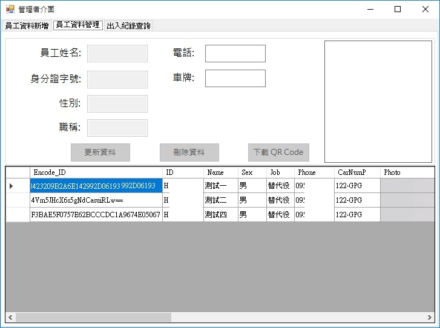

# 
出入口管理系統(QR Code)

### 主要功能
         QR Code掃描記錄進出人員資料　
         
### 套件
         QR Code -> ZXING 
         
### DES加密法加密身分證字號 
        private string Encode(string encode)//DES加密
        {
            string original = encode;
            string key = "abcdefgh";
            string iv = "12348765";

            DESCryptoServiceProvider des = new DESCryptoServiceProvider();
            des.Key = Encoding.ASCII.GetBytes(key);
            des.IV = Encoding.ASCII.GetBytes(iv);
            byte[] s = Encoding.ASCII.GetBytes(original);
            ICryptoTransform desencrypt = des.CreateEncryptor();
            return BitConverter.ToString(desencrypt.TransformFinalBlock(s, 0, s.Length)).Replace("-", string.Empty);

        }
## 掃描頁面

## 掃描頁面

## 出入記錄查詢頁面

## 員工資料管理頁面

## 員工資料新增頁面

## 系統L頁面

